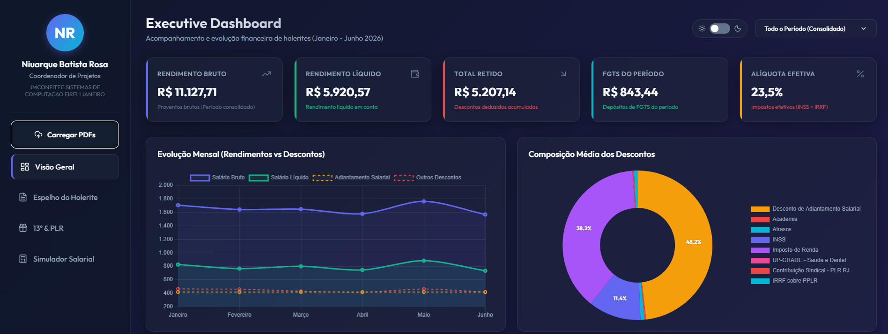

# Dashboard Confitec

Plataforma executiva pessoal de Business Intelligence (BI) para consolidar, analisar e simular dados financeiros de holerites em formato PDF.

A aplicação roda 100% no navegador — sem backend, sem banco de dados, sem upload para servidores externos. Os PDFs são processados localmente via [PDF.js](https://mozilla.github.io/pdf.js/) e os dados permanecem no contexto da sessão.



> _Valores exibidos nas imagens são fictícios — gerados a partir de um fator de disfarce para demonstração pública._

---

## Funcionalidades

- **KPIs em tempo real**: Rendimento Bruto, Líquido, Total Retido, FGTS do período e Alíquota Efetiva (INSS + IRRF).
- **Visão Geral**: gráficos de evolução mensal, composição de descontos, origem de renda (fixo vs. variável) e depósitos de FGTS.
- **Espelho de Holerite**: réplica visual fiel do recibo oficial, navegável por período.
- **13º e PLR**: relatórios direcionados sobre bonificações extras.
- **Simulador Salarial**: sliders interativos (salário base, horas extras, sobreaviso, ajuda de custo) com projeção de líquido e tributos progressivos em tempo real.
- **Tabela detalhada**: filtro multi-seleção por período e rubrica, com exportação para CSV e PDF.
- **Tema Claro/Escuro** com persistência via `localStorage`.

---

## Stack Técnica

| Camada | Tecnologia |
|--------|------------|
| Estrutura | HTML5 semântico |
| Estilo | CSS3 puro (variáveis customizadas, Grid, Flexbox, Glassmorphism) |
| Lógica | JavaScript ES2022+ (Módulos nativos `import`/`export`) |
| Gráficos | [Chart.js](https://www.chartjs.org/) (via CDN) |
| Parsing PDF | [PDF.js](https://mozilla.github.io/pdf.js/) (via CDN) |
| Ícones | [Lucide](https://lucide.dev/) (via CDN) |
| Exportação | [jsPDF + jsPDF-AutoTable](https://github.com/parallax/jsPDF) (lazy load via CDN) |
| Fonte | [Outfit](https://fonts.google.com/specimen/Outfit) (Google Fonts) |

**Zero dependências em `node_modules`. Zero build step.** O projeto roda diretamente em qualquer servidor estático.

---

## Estrutura do Projeto

```
dashboard-confitec/
├── index.html                  # Ponto de entrada da aplicação
├── README.md                   # Este arquivo
├── .gitignore                  # Ignora /pdfs e artefatos locais
├── docs/
│   └── GEMINI.md               # Documentação histórica original
├── pdfs/                       # (gitignored) PDFs reais de holerites
└── src/
    ├── css/
    │   └── styles.css          # Design system + componentes
    └── js/
        ├── main.js             # Orquestração e ponto de entrada
        ├── state.js            # Estado central da aplicação
        ├── config.js           # Constantes (tabelas fiscais, rubricas, CDN URLs)
        ├── utils/
        │   └── formatters.js   # Formatadores BRL, percentual, escape HTML
        ├── data/
        │   ├── payroll-store.js    # Store de holerites + agregações
        │   └── payroll-parser.js   # Parser de texto extraído dos PDFs
        ├── ui/
        │   ├── theme.js            # Alternador claro/escuro
        │   ├── navigation.js       # Sistema de abas
        │   ├── multiselect.js      # Multiselects customizados
        │   ├── kpis.js             # Cartões de indicadores
        │   ├── summary-table.js    # Tabela resumo geral
        │   ├── items-table.js      # Tabela detalhada por rubrica
        │   ├── bonuses.js          # Aba 13º e PLR
        │   ├── holerite-mirror.js  # Espelho visual do holerite
        │   ├── simulator.js        # Simulador salarial
        │   ├── sidebar-profile.js  # Perfil na sidebar
        │   ├── export.js           # Exportação CSV/PDF
        │   └── upload-modal.js     # Modal de upload de PDFs
        └── charts/
            └── charts.js           # Construção e atualização dos Chart.js
```

### Princípios da Arquitetura

- **Separação por responsabilidade**: cada arquivo tem uma única responsabilidade clara (UI, dados, configuração, utilitários).
- **ES Modules nativos**: sem bundler. O navegador resolve as dependências via `import`/`export`.
- **Estado central**: `state.js` mantém os dados carregados, evitando variáveis globais espalhadas.
- **Constantes isoladas**: tabelas fiscais (INSS/IRRF), códigos de rubrica e URLs ficam em `config.js` — fáceis de atualizar quando a Receita Federal mexer nas faixas.
- **Parser separado da UI**: `payroll-parser.js` é função pura (texto → objeto), sem tocar no DOM. Permite testes futuros sem mock de browser.
- **Escape de HTML**: todo valor proveniente de PDF é escapado antes de injeção no DOM (defesa contra XSS em PDFs maliciosos).
- **Lazy loading**: bibliotecas pesadas (jsPDF) só são carregadas quando o usuário aciona o recurso.

---

## Como Executar Localmente

A aplicação precisa de um servidor HTTP (ES Modules não funcionam ao abrir `index.html` direto do disco por restrição CORS do navegador).

### Opção 1 — Node.js (recomendado)

```bash
npx http-server ./ -c-1
```

### Opção 2 — Python 3

```bash
python -m http.server 8000
```

### Opção 3 — Extensão Live Server (VS Code)

Clique com o botão direito em `index.html` → **Open with Live Server**.

Após iniciar, acesse `http://localhost:8080` ou `http://localhost:8000`.

---

## Como Usar

1. Acesse o dashboard no navegador.
2. Clique em **Carregar PDFs** na sidebar.
3. Arraste e solte (ou selecione) os PDFs de holerite originais da Confitec.
4. O parser extrai automaticamente proventos, descontos, bases de cálculo (INSS, IRRF, FGTS) e popula:
   - Cartões de KPI consolidados
   - Gráficos de evolução
   - Tabela detalhada por rubrica
   - Espelho fiel do recibo
5. Use o multiselect no topo para filtrar por período.
6. Acesse a aba **Simulador Salarial** para projetar cenários.

---

## Privacidade e Segurança

- **Nenhum dado sai do navegador.** Não há requisições para backends próprios. As únicas conexões externas são para os CDNs das bibliotecas (Chart.js, PDF.js, Lucide, Google Fonts).
- **PDFs reais nunca são versionados.** A pasta `pdfs/` está no `.gitignore` para evitar commit acidental de dados sensíveis.
- **Defesa contra XSS**: todo conteúdo extraído de PDFs passa por `escapeHtml()` antes de ser inserido no DOM.

---

## Roadmap

- [ ] Persistência local opcional via `IndexedDB` para evitar reupload a cada sessão.
- [ ] Comparativo anual quando houver dados de múltiplos anos.
- [ ] Projeção do segundo semestre baseada no histórico carregado.
- [ ] Testes unitários do parser e do simulador (Jest ou Vitest).
- [ ] Validação automatizada das tabelas fiscais quando a Receita publicar atualizações.

---

## Licença

Projeto pessoal de uso privado. Não é afiliado oficialmente à JMCONFITEC SISTEMAS DE COMPUTAÇÃO EIRELI.
